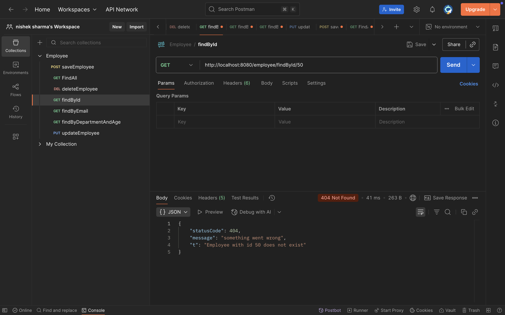
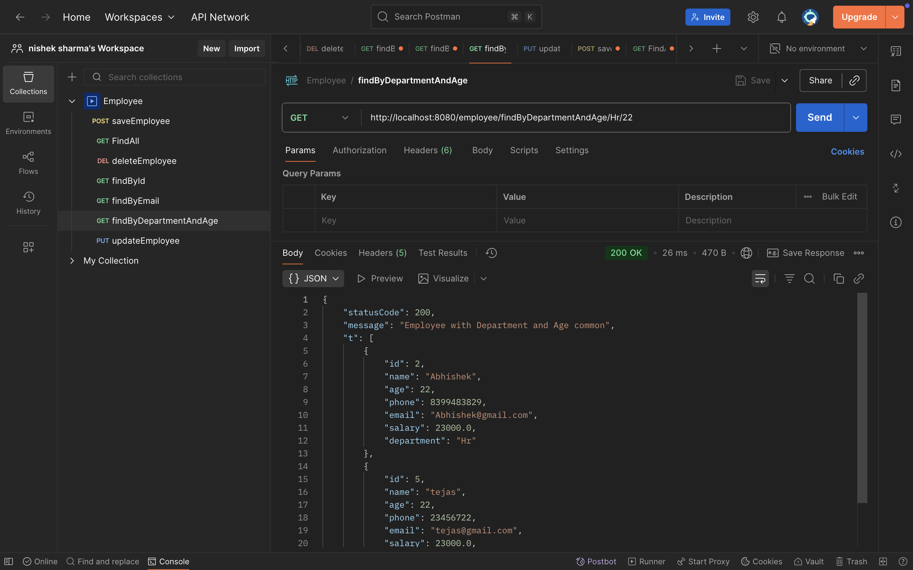
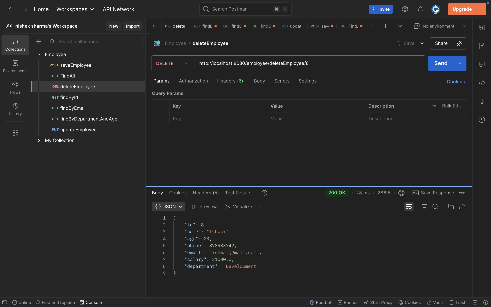

# Learnings
## 1. JPA Repository Custom Methods
- To create a user-defined method to fetch data from the database, use the **`findBy`** prefix followed by your method name.  
- Example: in `JpaRepository<Employee, Integer>`, you can define:
  ```java
  List<Employee> findByDepartment(String department); // Abstract Method in (Repository interface extends JpaRepository<Entity, PrimaryKeyType>)
  
## 2. Response Structure

- Standardized way to design how response objects look (status, message, data).

- Each company may follow its own format, but most use a common pattern.

- Implemented as a simple class (commonly named ResponseStructure).

- Defines the body of the response only (status code, message, object).

- code snippet to understand:-
public class ResponseStructure<T> {
	
	private int statusCode;
	private String message;
	private T t;
}

# 3. Response Entity

- Represents the full HTTP response (status code + headers + body).

- Allows modifying the entire response, not just the message/body.

- Wraps the ResponseStructure object to send back to the client.

- Used when you want both custom response structure and proper HTTP status handling.

- ResponseStructure<Employee> responseStructure = new ResponseStructure<Employee>(HttpStatus.CREATED.value(), "Employee Added Successfully!", emp);
		
  	return new ResponseEntity<ResponseStructure<Employee>>(responseStructure, HttpStatus.CREATED);


  
	

- In short:-
- ResponseStructure → defines body format.
- ResponseEntity → wraps ResponseStructure + controls HTTP response (status, headers, body).

# Employee API Screenshots

# Save Employee
This API is used to add a new employee into the database.  


## Find All Employees
This API fetches the complete list of employees from the database.  


## Find Employee By ID
This API retrieves employee details using their unique ID and returns StatusCode = 404 and Message = "Something went Wrong :(".  


### Example: Find By ID (1)
Fetches employee details with ID = 11.  
.png)

## Find Employee By Email
This API retrieves employee details using their email and returns StatusCode = 404 and Message = "Something went Wrong :("..  


### Example: Find By Email (1)
Fetches employee with the given email.  
.png)

## Find Employee By Department and Age
This API filters employees based on their department and age.  


## Update Employee
This API updates the details of an existing employee.  


### Example: Update Employee (1)
Updates the employee with ID = 100 and returns StatusCode = 404 and Message = "Something went Wrong :(".  
.png)

## Delete Employee
This API deletes an employee record from the database using ID.  



